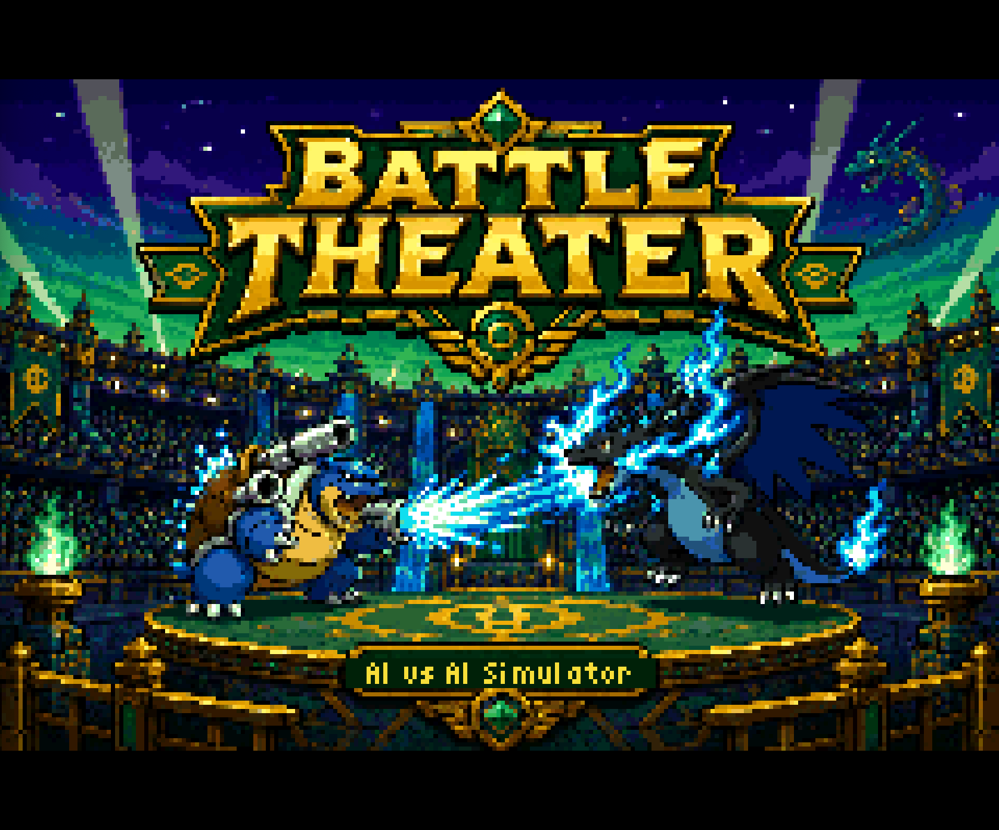
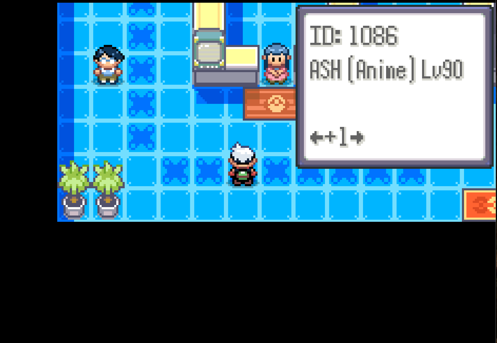
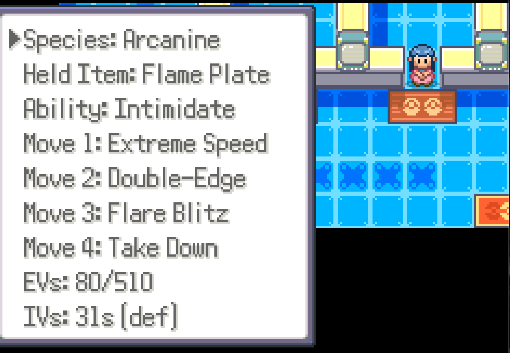
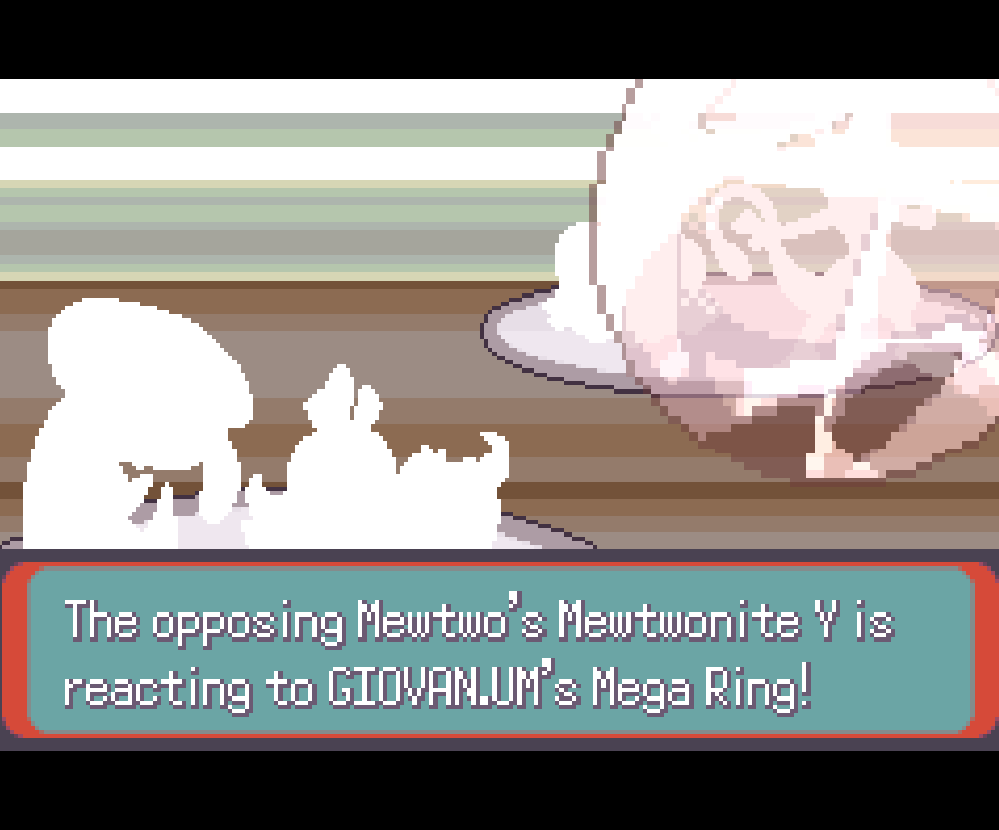
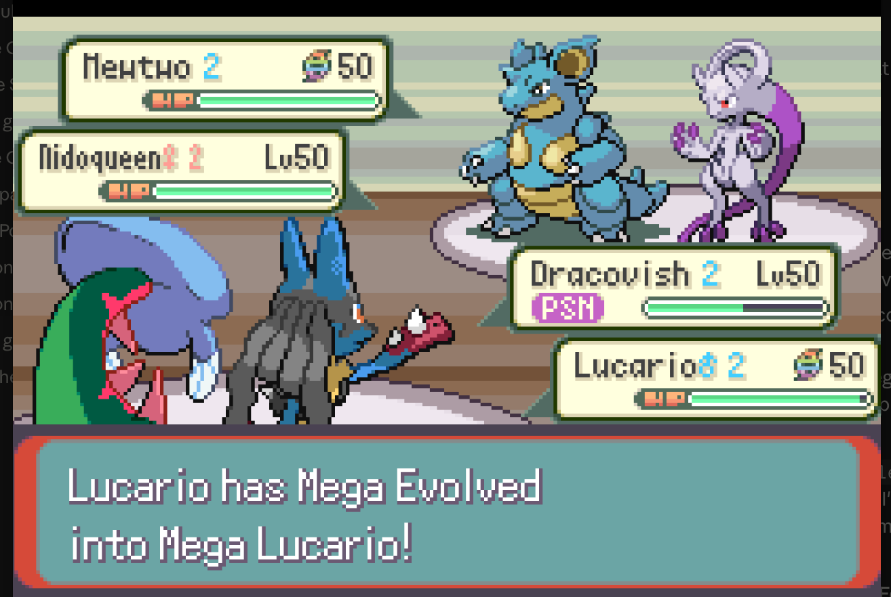

# Pokemon Battle Theater

<p align="center">
  
</p>

An AI vs AI Pokemon battle simulator built on
[pokeemerald-expansion 1.15.2](https://github.com/rh-hideout/pokeemerald-expansion).
Pit any two trainers from the mainline games (Gens 1-9) against each other,
or pilot one side via Pilot Mode.

**Download the latest patch:** [v1.7 — Battle Frontier Challenge Mode (borrow any trainer's team)](https://github.com/logdog2325/pokemon-battle-theater/releases/latest).
All releases live on the [Releases page](https://github.com/logdog2325/pokemon-battle-theater/releases).

---

## In-game

| Roster picker | Custom Trainer editor |
|---|---|
|  |  |
| ~120 trainers across every generation. L/R jumps between regions. | Full per-mon editor saved to your file — sprite / name / species / item / ability / EVs / IVs / 4 moves / nature / gender / shiny. |

| Mega Evolution mid-trigger | Doubles + Mega in action |
|---|---|
|  |  |
| Z-Move / Mega / Dynamax / Gigantamax all wired with AI bias tuning. | Doubles, multi-battles, tournament brackets, best-of-N — every format works AI-vs-AI. |

---

## What this is

- ~120 curated rosters spanning Kanto / Johto / Hoenn / Sinnoh / Unova /
  Kalos / Alola / Galar / Hisui, plus the PWT and Ash's anime World
  Champion team
- **Hold L or R in the trainer picker to jump to the previous / next
  region** — fastest way to skip past the ~250 trainer entries instead of
  scrolling one at a time
- 9-trainer Legends Arceus section (Volo, Adaman, Irida, Ingo, Akari,
  Kamado, Zisu, Beni, Rei)
- **Full BW2 PWT roster** including the Striaton trio (Cilan, Chili, Cress),
  Cheren, Roxie, and Bianca's World Leaders Tournament team *(v1.5)*
- **2012 VGC World Finals teams** — Wolfe Glick (runner-up) and Ray Rizo
  (champion). Their iconic Trick Room vs. Tailwind battle, recreated *(v1.5)*
- **Prof. Oak Glitch boss** — the unused RGBY final boss with 3 starter
  variants, using the canonical FRLG sprite *(v1.6.1)*
- 6 Custom Trainer slots with full PKHeX-style editor (sprite / name /
  species / item / ability / EVs / IVs / moves / nature / gender / shiny) —
  **teams persist across sessions as of v1.4.1**
- **Showdown team-code import** — paste a 24-character code to load any
  team you built on Pokémon Showdown directly into a custom slot. No
  internet, no link cable, no patching
- **Battle Frontier Challenge Mode** — borrow any preset trainer's team
  and challenge the Frontier with it. See
  [Frontier Challenge](#battle-frontier-challenge-mode) below *(v1.7)*
- Tournament mode (8-trainer single-elim brackets across all regions),
  including a **pooled-mode PWT Unova** that draws a different 7-trainer
  bracket each run from the full Unova roster *(v1.5)*
- Best-of-N matches with adaptive picks
- VGC mode (forced doubles, Lv 50 cap, 4-pick-of-6)
- Pilot Mode — play *against* the AI yourself using a loaner team
  (see [Pilot Mode](#pilot-mode) below)
- Custom Battle Theater background by LiYun
- Fan-made placeholder title screen by u/Itchy-Hedgehog-3371
  (Mega Blastoise vs Mega Charizard X)
- AI tweaks for Z-Move / Mega / Dynamax / Gmax bias
- Custom singles AI controller (fixes vanilla post-KO crash)
- Affection and Terastallization disabled

## Building custom trainers

You can build up to 6 of your own trainers from scratch and pit them
against the preset rosters or each other.

**Opening the editor:** boot the ROM, pick **Build Trainer** from the
opening menu, then choose a slot (1–6).

**What you can edit:**
- Trainer name, sprite class (Lass, Ace Trainer, Cynthia, etc.)
- Per Pokémon: species, held item, ability, 4 moves, EVs, IVs, nature,
  gender, level, shiny toggle

**Two shortcuts to skip the from-scratch build:**
- **Copy preset** — start from an existing trainer's team (Cynthia,
  Volo, Logan's team, etc.) and tweak from there. Saves you ~10 minutes
  per team if you mostly want to swap moves or items on a known set
- **Import from code** — paste a 24-character Showdown team code to
  instantly load a team you built externally — see
  [Showdown team codes](#showdown-team-codes) below for the full flow

**Persistence:** as of v1.4, every edit you confirm flushes to your
save automatically — close the ROM, reopen it, your custom trainers
are still there. (Earlier versions wrote to memory but never to flash,
so trainers got wiped on power-off.)

Once a slot is filled, your custom trainer shows up in the trainer
picker alongside the preset roster.

## Showdown team codes

Pokemon Battle Theater includes a team-code system (added v1.2, polished
in v1.3) that lets you transport a complete competitive team into the
ROM via a short text code — no internet, no link cable, no patching
required. Inspired by Marvel Snap / Hearthstone deck imports.

### The flow

1. **Build a team on [Pokémon Showdown](https://pokemonshowdown.com/teambuilder)**
   (or anywhere that produces the standard Showdown text format)
2. **Open the [offline encoder](tools/team-codes/encoder.html)** in your
   browser. It's a single HTML file — no install, no network needed,
   works on your phone or laptop
3. **Paste your Showdown team** into the encoder. It spits out a
   24-character code like `Y9XK.MEW2.HK4N.GQ5W.J2RZ.YAAQ`
4. **In the ROM:** Build Trainer → pick a slot → **Import from code**
5. **Type the 24 characters** using the in-game keyboard (alphanumeric
   + period as a separator, no need to remember casing or symbols).
   Press confirm
6. **The full team materializes** in the slot — species, item, ability,
   moves, EVs, IVs, nature, gender, shiny, and trainer name, all
   decoded inside the ROM

### Why it's cool

- **No internet, no link cable** — works on stock hardware or any
  emulator. The 24-char code is the entire team
- **Compact** — 24 chars covers everything for up to 6 Pokemon. The v2
  format is bit-packed (~25% shorter than the v1 prototype) by storing
  each field at exactly the bits needed instead of byte-aligned
- **Showdown-native** — paste any team from Showdown's teambuilder
  directly; the encoder handles all field translation
- **Persists with v1.4** — once you import a team, it's saved to your
  cartridge save and survives power-off

### Use cases

- **Share teams** — paste a code in Discord, your friend imports it
  in their ROM in 30 seconds
- **Test competitive teams** in a casual emulator setting before
  committing them to a Showdown ladder run
- **Build on mobile, play on emulator** — open the encoder HTML on
  your phone while you're out, copy the code, paste it into your
  laptop's ROM when you get home
- **Tournament organizers** — players submit team codes instead of
  formatted text files; the host can verify legality by decoding

### Credits

Idea for the deck-code import flow came from
[u/Healthy_Bug7977](https://www.reddit.com/user/Healthy_Bug7977/) and
[u/LordePachi](https://www.reddit.com/user/LordePachi/) on r/PokemonROMhacks,
who pointed at Marvel Snap / Hearthstone's deck imports and asked
whether something similar would work for Pokemon teams. Turns out: yes.

## Battle Frontier Challenge Mode

Pick any trainer in the picker and thought *"I want to take that team into
the Battle Frontier"*? As of v1.7 you can. Frontier Challenge is a new
entry on the boot wrapper menu that:

1. Opens the **curated trainer picker** directly (no sim setup screen — just
   pick a trainer)
2. Loads that trainer's full 6-mon team as your party
3. Warps you straight into the Battle Tower lobby ready to challenge any
   of the 7 facilities (Tower / Dome / Palace / Arena / Factory / Pike /
   Pyramid)

You can pick from any of the ~120 preset trainers (Cynthia's team, Wolfe
Glick's 2012 VGC squad, Ray Rizo's championship Trick Room build, Volo's
Hisuian sweepers, Prof. Oak Glitch — whoever) **or** one of your 6 custom
trainer slots.

### What you get on launch

- 🏃 **Running shoes** — hold B to sprint the Frontier hub
- 🚲 **Mach Bike** in the bag — for the longer corridor runs
- 🏅 **All 8 Hoenn badges** — so high-level loaner mons (Lv 70+ legendaries
  on Champion teams) actually obey commands
- 🎫 **Frontier Pass** — receptionists let you in
- 💎 **Mega Ring / Z-Power Ring / Dynamax Band / Tera Orb** — gimmicks
  fire correctly in facilities that accept them
- 🪪 **Borrowed identity (v1.8)** — your player name becomes the trainer's
  name for the run. Pick Iris's team, you're "Iris" in every dialogue
  line, receptionist greeting, and trainer card. Soft reset to restore

### Idea credit

The Reddit player who found the v1.4 forfeit-to-overworld exploit and
pitched *"make it an official feature"* as a better fix than patching
the exit hole. They were right — this is way more fun than just blocking
the escape route.

### v1.8: modernized opponent pool

The Frontier opponents got a serious glow-up. **60 new competitive sets**
covering Gen 4-9 staples are now folded into the high-tier endgame trainer
pools, so streak-50+ matches actually feel like 2024 Smogon instead of
2003.

What you'll run into:

- **Gen 4 staples** — Garchomp (SD / Scarf / Mega), Hydreigon (Specs /
  Nasty Plot), Heatran (Specs / Air Balloon SR), Latios (Specs), Latias
  (CM Recover), Magnezone (Specs trapper / Body Press), Mamoswine, Weavile,
  Gliscor (Poison Heal toxic stall), Excadrill (Sand Rush)
- **Gen 5** — Volcarona (Quiver Dance), Ferrothorn (Spikes/Leech Seed),
  Rotom-Wash (Bulky WoW / Specs), Rotom-Heat (Scarf), Tornadus-T (Specs
  Hurricane), Landorus-T (Scarf / Defensive), Thundurus-T, Bisharp (SD),
  Kyurem-Black (DD Roost), Conkeldurr (Bulk Up Guts)
- **Mega Evolutions** — Mega Sceptile, Mega Charizard X, Mega Garchomp,
  Mega Lucario, Mega Alakazam (they auto-trigger on opponent side)
- **Gen 7 Tapus + co** — Tapu Koko (Specs / LO Mixed), Tapu Lele, Tapu Bulu
  (CB), Tapu Fini (Defog CM), Toxapex (Regenerator), Mimikyu (SD)
- **Gen 8** — Cinderace (Libero Pyro Ball), Corviknight (Bulk Up Body
  Press Mirror Armor), Dragapult (Specs / DD), Dracovish (CB Fishious Rend
  Strong Jaw)
- **Gen 9 paradox/ruin mons** — Kingambit (SD Supreme Overlord), Great
  Tusk, Iron Valiant, Roaring Moon (DD), Flutter Mane (CM), Gholdengo
  (Specs Make It Rain), Chien-Pao (CB Icicle Crash), Ting-Lu (defensive
  hazard setter)

Each mon has its real competitive ability slot (Libero, Regenerator,
Magic Guard, Huge Power, Protosynthesis, Quark Drive, the Ruin abilities,
Supreme Overlord, etc.), Smogon-style EV spread, nature, and held item
(Life Orb, Choice Specs/Band/Scarf, Heavy-Duty Boots, Booster Energy,
Toxic Orb, Mega Stones).

Modern mons are mixed into 10 endgame trainer pools (Expert M/F,
Cooltrainer 2C/2D, Dragon Tamer 2, Pokémaniac 2A/B/C, Gentleman 3A/B,
Hiker 3), so they cycle into rotation alongside the existing Gen 1-3
roster. You'll still see Tyranitar and Latios — they'll just be standing
next to Kingambit and Dragapult now.

## Pilot Mode

Most of this ROM is AI vs AI — you pick two trainers and watch them
duke it out. Pilot Mode flips that on its head: you control one side
yourself, using the chosen trainer's loaner team.

**What it gives you:**
- A way to *play* the rosters instead of just spectating
- A drop-in challenge mode — boot the ROM, pick a trainer to face,
  pick a trainer whose team you want to borrow, fight
- No grinding required. You don't level mons, you don't catch them,
  you don't earn badges — pilot mode auto-grants all 8 badges for
  obedience and suppresses XP gain so the loaner team stays at the
  intended level for the matchup
- Works against any preset trainer or any of your 6 custom slots

**How to enable:** in the wrapper menu, toggle **Pilot Mode** on, then
pick which side you want to control. Run the battle as normal — the
battle UI lets you select moves, swap mons, use items, the works.

## Building from source

You'll need [devkitARM](https://devkitpro.org/) and the standard
pokeemerald-expansion toolchain. Then:

```sh
git clone https://github.com/logdog2325/pokemon-battle-theater.git
cd pokemon-battle-theater
make -j4   # produces pokeemerald.gba
```

To produce a `RELEASE_BUILD` (Logan + Taylor stripped from the picker),
uncomment `#define RELEASE_BUILD 1` at the top of `src/debug.c` and rebuild.

## Distributing a patch

The release ROM cannot be shared directly (Nintendo copyright). Use
[Flips](https://github.com/Alcaro/Flips) to generate a `.bps` patch from
your modded ROM against vanilla Emerald (USA, MD5
`605b89b67018abcea91e693a4dd25be3`), and distribute just the `.bps`.

```sh
flips --create --bps vanilla-emerald.gba pokeemerald.gba pokemon-battle-theater.bps
```

## Upstream

This is a fork of
[rh-hideout/pokeemerald-expansion](https://github.com/rh-hideout/pokeemerald-expansion).
The pokeemerald-expansion README is preserved at
[`UPSTREAM_README.md`](./UPSTREAM_README.md) for engine docs / contribution
flow / debug menu reference.

## Credits

- pokeemerald-expansion engine + decompilation project
- LiYun — Battle Theater background art
- Bulbapedia / Smogon archives — canonical trainer rosters
- u/Healthy_Bug7977 and u/LordePachi — suggested the Marvel Snap / Hearthstone–style
  deck-code import that became v1.3's Showdown team-code feature
- u/Itchy-Hedgehog-3371 — drew the v1.6 placeholder title screen (Mega Blastoise vs
  Mega Charizard) while a real artist commission is in progress

Not affiliated with Nintendo, Game Freak, or The Pokémon Company.
Pokémon and all related marks are trademarks of their respective owners.
This is a fan-made, non-commercial modification.
